---
output:
  xaringan::moon_reader:
    css: ["default", "hygge", "tiny.css"]
    self_contained: true
    seal: false
    nature:
      ratio: "16:9"
title: "glatos 2022"

---

class: title-slide, center

# Tagging the tiny:  Observations from tagging small fish

</br>

### Todd Hayden, Darryl Hondorp, Chris Holbrook

<!-- 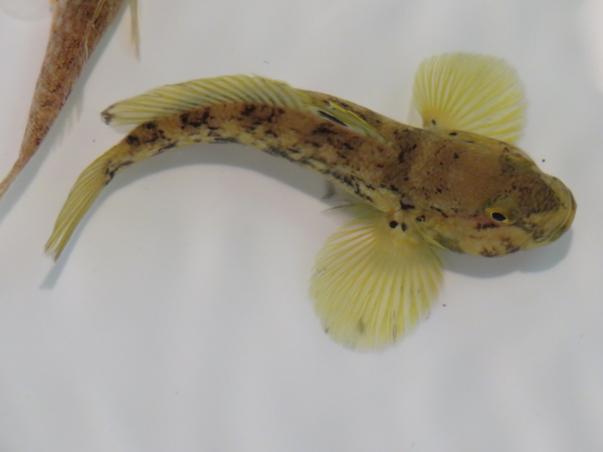 -->
<!-- 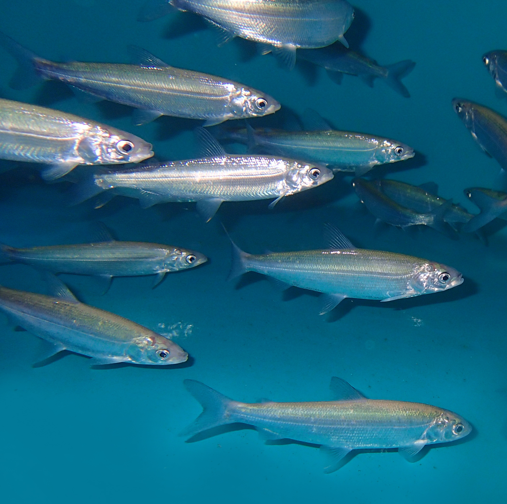 -->


</br>


---

class: left, top

## .center[Acknowledgements]

.pull-left[.large[
- Brad Buechel
- Zac Wickert
- Henry Thompson
- Karen Slaght
- Erick Larson
- Roger Gorgon
- Andrew Honsey
- Tom Binder
- Aaron Fisk
- Max Becker
- Dave Fielder
]
]
.pull-right[.large[
- USGS
- GLFC
- GLATOS
- RAEON
- USFWS
- MSU
- MDNR
]
]

<div class="flex2">
  
  
  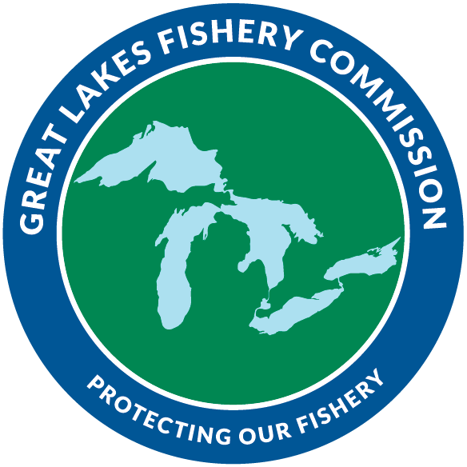
  
  	</div>


  
<div class="flex2">
  
    
  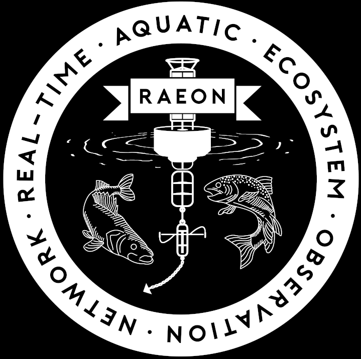
	</div>

---

class: center, middle

# Tales of tagging two "small" fishes...

---


class: left, top

.center[
## Round goby (*Neogobius melanostomus*)
]

.pull-left[.large[
- Invasive (1990), movements unknown
- Objective: 
  - Internal vs external, tag size
- Methods:
  - Baited minnow traps
  - TENS
  - Innovasea V4, V5 (180 kHz)
  - Goby size: 70 - 150 mm TL
  - 5-0 sutures
- Results
  - Tagging negatively affected survival
  - External tags- .red[high] shedding rates
]
]

.pull-right[.center[

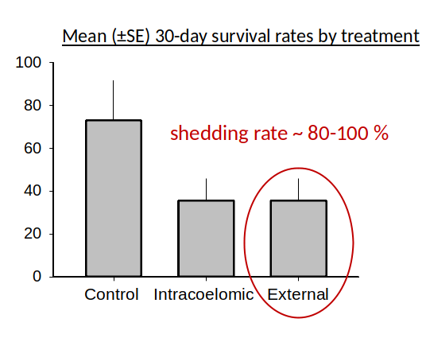


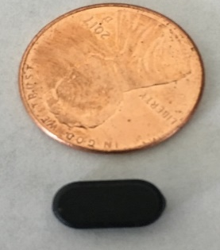

]
]
---

class: left, top

.center[
## Round goby
]

.left[.large[
- Objectives:
  - .grey[Identify factors affecting detection data quality/volume]
  - .grey[Assess spatial scale of goby movement]
  - .red[Did tagged fish survive?]
  ]
]

.center[
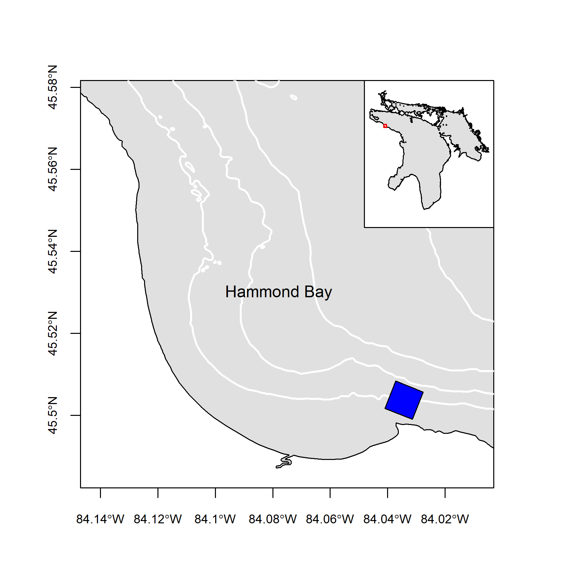
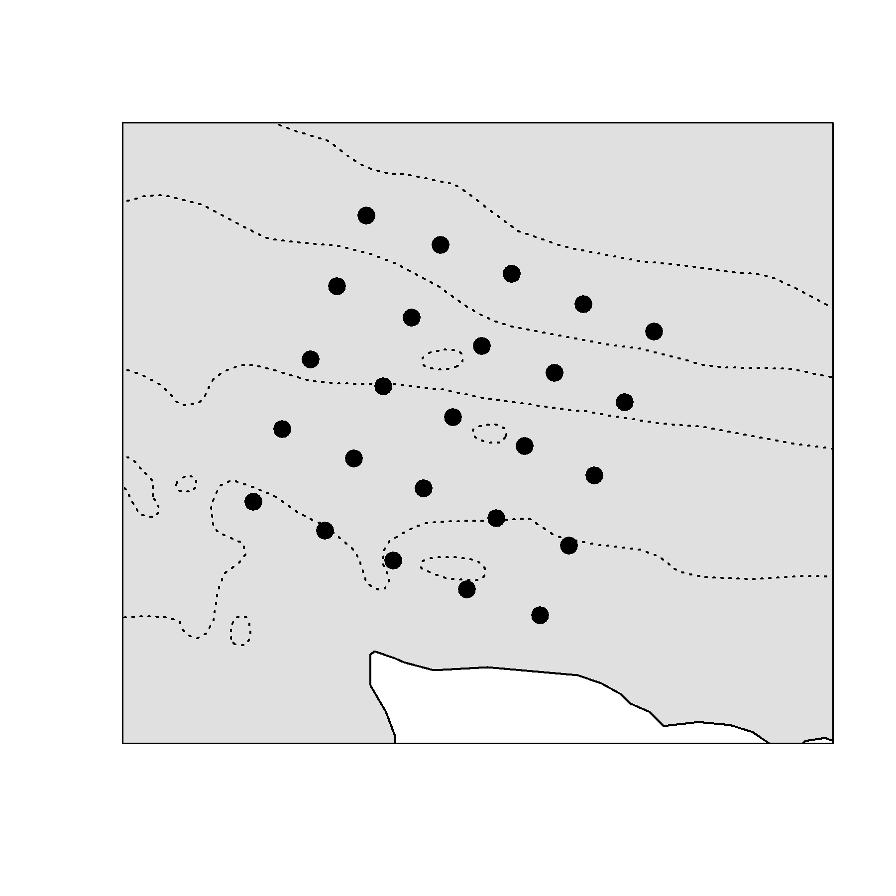
]

---

class: center, top

## Round goby - results

.center[
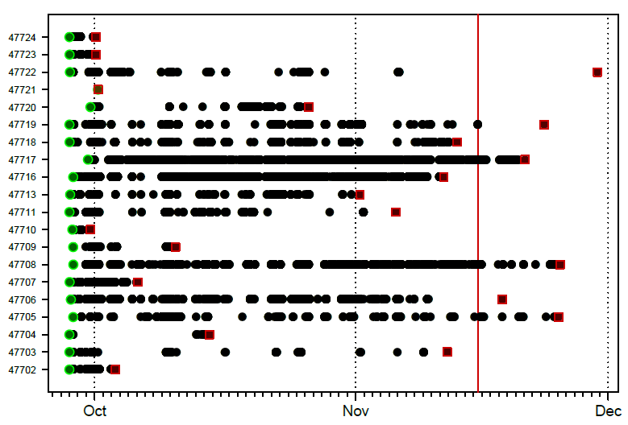
]

---

class: left, top

.center[
## Cisco (*Coregonus artedi*)
]

.pull-left[.large[
- Objective:
  - Survival, tag effect
- Methods:
  - Hatchery-reared cisco, JRNFH
  - TENS
  - Innovasea V5 (4.3mm x 5.7 mm x 12.7 mm)
  - PIT tag- 8 mm x 1.4 mm
  - ~140 mm
  - 5-0, 3/8 Reverse cut, 13 mm
  - HBBS wet lab
  ]
  ]
  
.pull-right[.center[


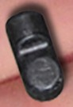
]
]

---

class: left, top

.center[
## Cisco Laboratory Study
]

.pull-left[.large[
- Treatments (N = 30)
    - Acoustic - V5 tag + PIT tag 
	- Control - no tags
	- PIT - pit tag
	- Sham- surgery + PIT tag
- Results
  - Control and PIT groups - 100% survival
  - Sham and acoustic - 75% survival, 30 days
  - dead fish- .infection around sutures
- .large[All fish held in 1 - 2 m tank]
]
]

.pull-right[.center[
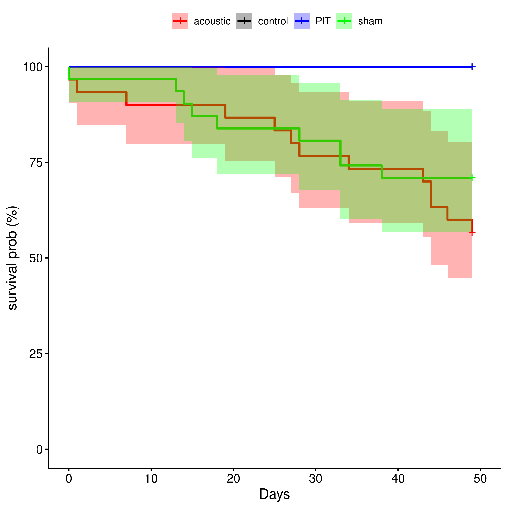

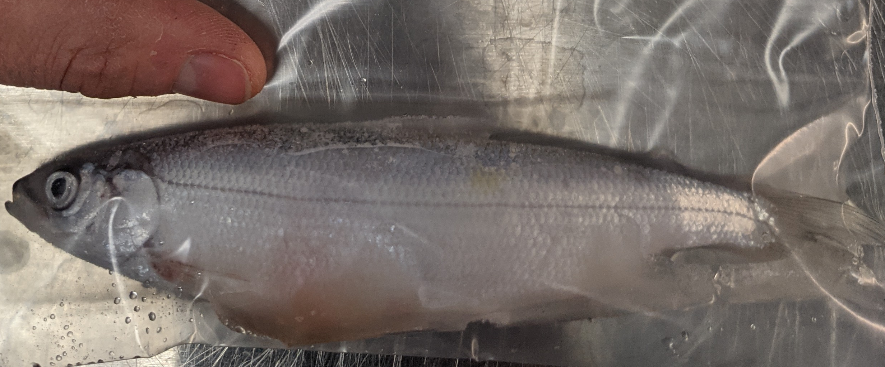
]
]

---

class: left, top

.center[
## Cisco - Saginaw Bay
]
.pull-left[
.large[
- Objectives
  - Spatio-temporal movement patterns
  - Survival and predation
- Methods
  - ~160 mm TL
  - V5D-1x tags (predation), N = 26
  - Surgery ~ 2 weeks prior to release
  - TENS
  - 5-0 mono, 3/8 circle reverse cut, 13 mm
  - Released October 9, 2021
- Results
  - .red[100% survival]
  ] 
]

.pull-right[.center[

```{r embeded, out.width='100%', out.height='100%', echo = FALSE}
knitr::include_url('https://haydento.github.io/index.html')
```
]
]

---

class: top, center

## Cisco - Saginaw Bay

.left[.large[
- 7 tags broadcast predation code (73% survival, 15 days)
- Most left in 5-6 days
- No fish returned (active October-December)
]
]

<video width="38%" height=auto controls loop>
	<source src="images/juv_cisco.mp4" type="video/mp4">
</video>


---

class: center, middle

# Observations from surgically implanting tags in small fish

---

class: left, top

.center[
## Observations from tagging round goby and juvenile cisco
]

.pull-left[.large[
- Downsize equipment
  - Cradel, measure, TENS electrodes
  - Low volume Freshwater supply
      - DC motor control
      - Peristaltic pump
  - Lighting
  - Sutures- mono or braided?
	- Braided is more pliable, tighter knots
	- Each suture material requires specific technique
	- .bold[.purple[Purple]] suture improves visibility
	]
		]
	
.pull-right[.center[	

]
]

---

class: left, top

.center[
## Observations from tagging round goby and juvenile cisco
]

.large[
- Small fish =  small body cavity. Location of incision depends on morphology and space to implant tag.
- Thin and fragile body wall.  Sutures can easily pull through tissue when secured.
- Needle shape- short and curved needle- hard to follow head of needle with rest of needle, causes "tearout".
- Fine motor skills are more important with small fish
  - Targeted regions are small
 ]

.center[


]
---

.center[
## Observations from tagging round goby and juvenile cisco
]

.large[
- Post-operative care
 - Water quality
 - Handling stress and tank stress = decreased survival
     - Low tank density
     - Minimize handling
	 - Consider mild salt bath (~0.25%) to help control infection
 - Release fish as soon as swimming 
	]
	
.center[

]


